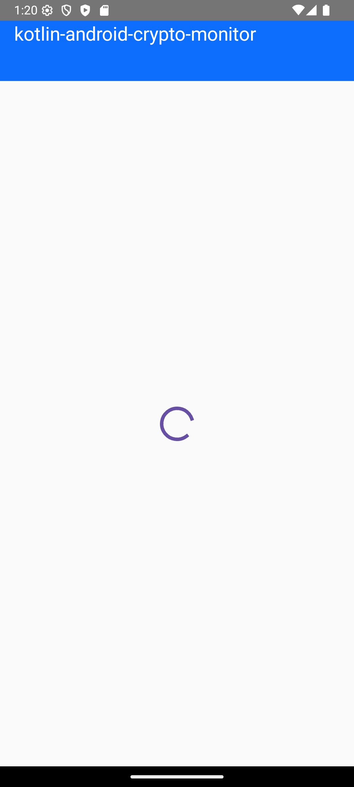
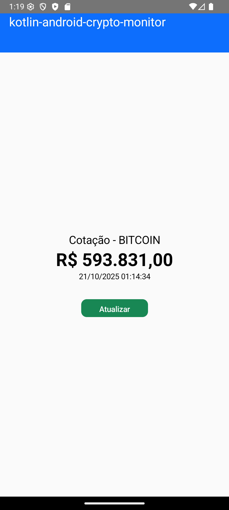

# Monitor de Criptomoedas

Este é um aplicativo Android nativo que monitora o preço de criptomoedas em tempo real, utilizando a API do Mercado Bitcoin.

O projeto foi originalmente desenvolvido com layouts em XML e foi **refatorado para usar Jetpack Compose**, seguindo as práticas mais modernas de desenvolvimento Android com UI declarativa.

---

## Funcionalidades Principais

- **Consulta de Cotação:** Exibe o último preço negociado de uma criptomoeda.
- **Atualização em Tempo Real:** Permite que o usuário atualize a cotação a qualquer momento com o botão "Atualizar".
- **Interface Moderna:** Toda a interface foi construída com Jetpack Compose.

### Melhorias Adicionais

Para aprimorar a experiência do usuário e a robustez do aplicativo, foram implementadas as seguintes melhorias:

- **Feedback de Carregamento:** Um indicador de progresso é exibido na tela enquanto os dados da cotação são buscados na internet.
- **Tratamento de Erros:** Caso ocorra uma falha na conexão ou a API retorne um erro, uma mensagem clara é exibida para o usuário.
- **Carregamento Inicial:** Os dados são carregados automaticamente assim que o aplicativo é iniciado.

---

## Tecnologias Utilizadas

- **Kotlin:** Linguagem de programação principal.
- **Jetpack Compose:** Toolkit moderno para construção de UI nativa do Android.
- **Coroutines:** Para gerenciamento de tarefas assíncronas, como chamadas de rede.
- **Retrofit:** Cliente HTTP para realizar as chamadas à API do Mercado Bitcoin.
- **ViewModel:** Para gerenciar o estado da UI de forma consciente do ciclo de vida.

---

## Telas

Abaixo estão as telas que demonstram as funcionalidades do aplicativo em seus diferentes estados.

| Carregando | Cotação (Sucesso) | Erro de Conexão |
| :---: | :---: | :---: |
|  |  |  |

---

## Integrantes

- **Nome do Integrante 1** - `RM12345`
- **Nome do Integrante 2** - `RM54321`
